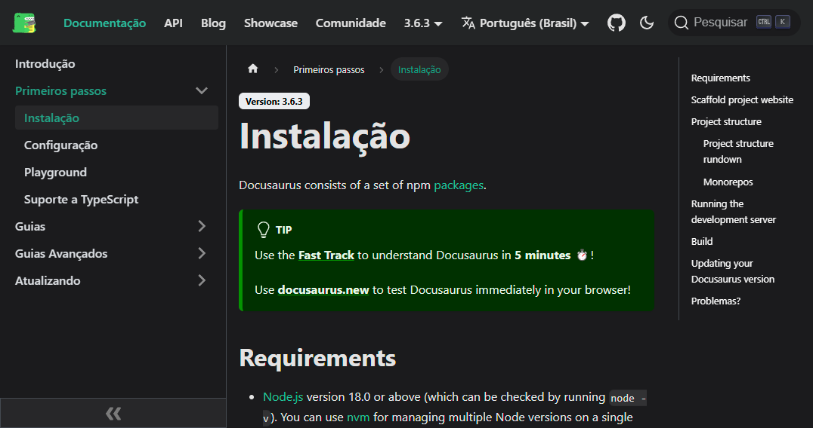
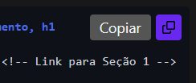
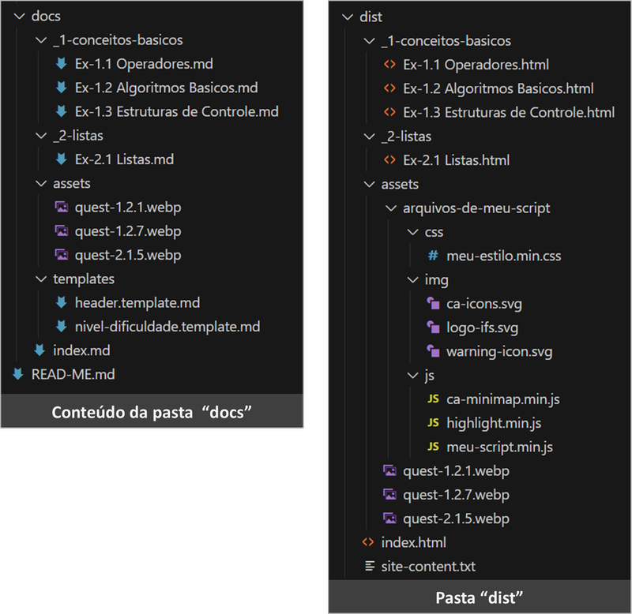

!!!__ INCLUDE "header.template.md" __!!!

<h2 class="ca-pg-title">Parte 1: Sobre o Projeto e sua Avaliação</h2>

--h:thin----------------------------------------------------------------------------------

<div class="bloco-my-1">
!!!__ ToC __!!!
</div>

--h:thin----------------------------------------------------------------------------------

## 1.1. Funcionalidades Principais

- O programa deve buscar todos os documentos Markdown (.md) na pasta `./docs` (documents) e subpastas, convertendo-os em HTML.
- O site gerado deve ser armazenado em `./dist` (distribution), mantendo a mesma hierarquia de diretórios presente em `./docs`.
- Os recursos (assets) - imagens, vídeos, CSS, JS ... - originalmente armazenados na pasta `./docs/assets` devem ser copiados para `./dist/assets` durante o processo de conversão.

A ferramenta a ser desenvolvida deverá apresentar as seguintes funcionalidades:

1. **Navegação**: Geração automática de menus, painéis de navegação e breadcrumbs para facilitar a navegação no site.

1. **Customização Visual**: Implementação de um sistema de templates ou temas para permitir a personalização da aparência do site, adaptando-se às preferências do usuário e identidade visual desejada.

1. **Suporte a Templates**: Para facilitar a reutilização de componentes como cabeçalhos, rodapés e outros elementos padronizados.

1. **Realce de Sintaxe de Código** (sintax highlight): Para melhorar a legibilidade e compreensão do código, utilizando diversas linguagens de programação.

1. **Copiar Código**: Funcionalidade copiar código com um clique utilizando JavaScript.

1. **Busca Local**: Mecanismos de indexação para permitir a busca de conteúdo dentro do site.

1. **Otimização para Mecanismos de Busca (SEO)**: Incorporação de técnicas de SEO, como metadados, URLs amigáveis, visando melhorar o posicionamento do site em mecanismos de busca.

1. **Geração de Feed RSS**: Criação automática de feeds RSS para facilitar a disseminação de atualizações do site. O feed RSS permite que os leitores do site recebam notificações e acompanhem as novidades de forma prática, sem precisar visitar o site frequentemente.

1. **Otimização de Recursos**: Minificação e otimização de arquivos CSS, JavaScript e imagens para melhorar o desempenho e tempo de carregamento do site.

1. **Conversão Markdown para HTML**: Para criação do website.

1. **Páginas Responsivas (NÃO é preciso)**: Por simplificação, o site NÃO precisa se adequar a diferentes tamanhos de telas.

--h:thin----------------------------------------------------------------------------------

Exemplo de um web site estático para servir de inspiração, o [Docusaurus](https://docusaurus.io/).

<div class="ca-center"></div>

- Observe na imagem acima:
    - NavBar, no topo da página.
    - "Sumário do site", os documentos, na barra lateral esquerda.
    - ToC, Table of Contents (tabela de conteúdo) da página, na barra lateral direita.
    - Busca Local, no topo direito da página.
    - Breadcrumbs (trilhas de navegação), logo acima do título da página.

- Ao navegar por está página, nos blocos de código você verá o ícone "Copiar Código", conforme a imagem abaixo.

<div class="ca-center"></div>

--h:thin----------------------------------------------------------------------------------

#### **Exemplo da estrutura de diretórios dos docs Markdown**

- Seu script deve varrer a pasta `./docs` para processar e converter os documentos Markdown em HTML.

Conteúdo da pasta `./docs` versus `./dist`, a pasta gerada pelo script.

<div class="ca-center"></div>

--h:thin----------------------------------------------------------------------------------

#### **Review da pasta ./dist**

- Durante a conversão, o script gera a `./dist` com o arquivos do site gerado. Os arquivos html gerados, as imagens ..., + os recursos gerados pelo script, tais como os estilos CSS, os arquivos JS, as imagens (p.ex. logo, favicon).
    - A estrutura de diretório foi mantida.
    - Novos recursos (assets) foram adicionados a `./dist/assets` em `arquivos-de-meu-script`. Responsáveis pela aparência e pela interatividade do site.
        - `css/meu-estilo.min.css`, minha versão do CSS github-dark customizado.
        - `img/ca-icons.svg` + `logo-ifs.svg` + `warning-icon.svg`, alguns ícones, logotipo do IFS, ícone warning.
        - `js/ca-minimap.min.js`, neste exemplo adicione um minimap no site. Incluído via script ao ver a tag `@@@[__ INCLUDE ca-minimap __]@@@` no doc Markdown.
        - `js/highlight.min.js`, responsável pelo realce de código (sintax highlight). Incluído via script ao encontrar um bloco de código.
        - `js/meu-script.min.js`, biblioteca JavaScript padrão de meu gerador.
    - Os arquivos CSS e JS estão minificados, `.min.css` e `.min.js`.
    - `site-content.txt` conteúdo do site (apenas texto), gerado pelo script. Usado na busca local por `lunr.min.js`.
    - As imagens estão no formato `.webp` (provê maior compressão, mantendo a mesma qualidade).
    - As imagens do usuário foram mantidas no próprio diretório `./dist/assets`.

--h:thin----------------------------------------------------------------------------------

#### **Exemplos reais para inspiração**

- Considere estudar outros geradores de sites web estáticos para inspiração. Exemplos:
    - <a href="https://docs.gitbook.com/" target="_blank">GitBook</a>
    - <a href="https://vitepress.dev/guide/what-is-vitepress" target="_blank">VitePress</a>
    - <a href="https://docusaurus.io/docs" target="_blank">Docusaurus</a>
    - <a href="https://docsify.js.org/#/?id=docsify" target="_blank">Docsify</a>
    - <a href="https://codehike.org/" target="_blank">Code Hike</a>
    - <a href="https://gohugo.io/documentation/" target="_blank">Hugo</a>
    - <a href="https://rust-lang.github.io/mdBook/" target="_blank">MdBook</a>

- Como converter documentos Markdown em HTML:
    - <a href="https://pandoc.org/" target="_blank">Pandoc Documentation</a>

- Sintaxe do Markdown:
    - <a href="https://sindresorhus.com/github-markdown-css/" target="_blank">GitHub Markdown CSS demo</a>
    - <a href="https://docs.github.com/pt/get-started/writing-on-github/getting-started-with-writing-and-formatting-on-github/basic-writing-and-formatting-syntax" target="_blank">Sintaxe do Markdown by GitHub</a>
    - <a href="https://github.github.com/gfm/" target="_blank">GitHub Flavored Markdown Spec</a>
    - <a href="https://www.markdownguide.org/" target="_blank">Markdown Guide</a>

--h:thin----------------------------------------------------------------------------------

## 1.2. Diretrizes de Desenvolvimento

As seguintes diretrizes devem ser consideradas durante o desenvolvimento do projeto:

1. **Linguagem de Programação**: Livre escolha. Sugestão: Python, C# ou Java. Considere a sua familiaridade com a linguagem e se está adequada ao problema. Para este projeto, performance e paralelismo é um ponto a ser considerado.

1. **Modularização**: O código deverá ser modularizado, utilizando funções e classes para organizar as diferentes funcionalidades, preferencialmente com um módulo para cada funcionalidade.
 
4. **Simplicidade**: A solução deve ser simples de usar para o usuário final. Se possível (é recomendação), sem a necessidade de instalação de programas adicionais. No máximo exigir apenas a instalação do interpretador Python ou do Java JRE etc. OBSERVAÇÃO: instalação é diferente de usar um programa portável, onde basta o EXE estar presente. Você pode usar quantos softwares de terceiros desejar, desde que sejam portáteis (não requer instalação).

1. **Integração com Ferramentas Externas**: É permitido o uso de softwares de terceiros, tais como: (a) usar o programa `ImageMagick` para converter imagens .png em .webp, para reduzir o tamanho dos arquivos para agilizar o carregamento das páginas; (b) usar o `Pandoc` para converter os arquivos Markdown (.md) em HTML.

1. **Execução**: O script deve ser executado via linha de comando (CLI), permitindo ao usuário especificar parâmetros e opções. É essencial fornecer feedback claro ao usuário durante o processo de conversão (ex: logs de progresso, mensagens de erro).

    - Adicionalmente (se desejar), para para facilitar a interação com o usuário final, pode-se implementar interface de acesso gráfica (GUI), desde que está invoque o script CLI.

1. **Múltiplos Scripts**: Se achar conveniente, a solução pode ser compostas por múltiplos scripts escritos em linguagens diferentes. Por exemplo: (a) Um programa escrito em C# para ajustar os hyperlinks, substituindo as extensões `.md` por `.html`. (b) Um script JavaScript para realizar a minificação dos arquivos CSS e JavaScript. (c) Um script Python para gerar automaticamente índices ou tabelas de conteúdo. (d) ...

    - IMPORTANTE: deve existir um script principal, para interação com o usuário. A partir de um único comando, tal como: `.\markdown-to-html.ps1 -prjDir "/meus-arquivos-em-markdown"` o site deve ser gerado.

1. **Configuração**: Permitir configurações através de um arquivo YAML para personalização de opções como temas, estrutura de navegação, entre outros.

1. **Documentação e Uso**:

    - *Arquivo README.md*: Incluir um arquivo README.md descrevendo o programa e, principalmente, contendo instruções para execução do programa.
    - *Exemplos Práticos*: Fornecer exemplos práticos de uso, demonstrando como usar o programa, assim como exemplos de respostas do programa.
    - *Comentários no Código*: Adicionar comentários claros e concisos no código, explicando a funcionalidade das principais seções e linhas de código. Isso facilitará a compreensão e manutenção do código por outros desenvolvedores.

--h:thin----------------------------------------------------------------------------------

## 1.3. Entrega do Projeto

### 1.3.1. Com Relação as Entregas PARCIAIS

- As entregas parciais devem ser realizadas semanalmente, preferencialmente após a aula, através de um commit no GitHub. Essas entregas são para fins de acompanhamento do professor com relação ao andamento do trabalho.
- Crie repositório GitHub e compartilhe com seu professor.
- **IMPORTANTE. Mantenha o arquivo CHANGELOG.md atualizado**, ou como é mais conhecido em português “O que já de novo?”, para cada Commit. Em outras palavras, você irá descrever para seu professor tudo que fez desde a última entrega. Exemplo:

    ```markdown
    # O que há de novo? (ChangeLog)


    ## [0.0.2] - 2024-12-31 - Add Toggle para as Seções
    ### Adicionado
    - Toggle para as Seções, contrair / expandir as seções com clique do mouse.

    ### Corrigido
    - Correção de bugs no Minimap alpha.

    ### Melhorado
    - Melhoria na documentação do código.

    ### TODO (coisas a fazer)
    - Próxima entrega:
        - Adicionar botão para o usuário alternar entre tema light ou dark com um clique.
        - Criar opção para evitar toggle de uma seção, 'ca-ignore-fold'.


    ## [0.0.1] - 2024-12-24 - Meu Primeiro Commit
    ### Adicionado
    - Conversão de Markdown para HTML.
    - Tema github-dark customizado.
    - Minimap alpha lançado.
    ```

### 1.3.2. Com relação a Entrega FINAL

<p class="ca-alert-warning">A parte escrita deve ser entregue ao menos 3 dias antes da apresentação do trabalho.</p>

1. **Código-Fonte Completo:**
   - Todos os arquivos do programa, organizados em pastas apropriadas. Exceto pastas de bibliotecas de terceiros, tais como `node_modules` (NodeJS) ou `venv` (python).
   - O código deve estar bem documentado, com comentários explicativos quando necessário.

2. **Arquivo READ-ME.md:**
    - Breve descrição do programa.
    - Guia de uso, mostrando como executar o programa.
    - Exemplos de uso e respostas esperadas.
    - Instruções de instalação das dependências (se necessário). P.ex. criação do ambiente virtual Python (venv) e da instalação das bibliotecas via requirements.txt.

3. **Arquivos de Configuração:**
    - Arquivos de exemplo de configuração que demonstrem como personalizar o programa.

4. **Exemplos de Conteúdo:**
    - Uma coleção de arquivos Markdown de exemplo.
    - O site gerado a partir desses arquivos, demonstrando as funcionalidades do programa.

5. **Relatório Técnico:**
    - Descrição da arquitetura do programa e das principais decisões de design.
    - Discussão sobre os desafios enfrentados (importante) e soluções implementadas.
    - Sugestões de trabalhos futuros, que não puderam ser realizados devido ao tempo e/ou escopo do trabalho.   

--h:thin----------------------------------------------------------------------------------

## 1.4. Critérios de Avaliação

<p class="ca-alert-warning">**IMPORTANTE**: O projeto é individual, MAS o artigo pode ser elaborado em grupo de até 4 pessoas.</p>

### 1.4.1. Funcionalidades Implementadas (20%)

- **Atendimento aos Requisitos Básicos:**
    - Implementação correta das funcionalidades exigidas.
    - Aplicativo funcionando sem falhas críticas.

- **Execução:**
    - Comportamento esperado em todas as funcionalidades implementadas.
    - Tratamento adequado de erros e exceções.
        - *Validação de Entradas*: Todas as entradas do usuário e do arquivo de configuração devem ser validadas.
        - *Captura de Exceções*: O script deve capturar exceções de forma proativa, evitando falhas catastróficas.
        - *Mensagens de Erro*: Mensagens de erro claras e informativas devem ser exibidas ao usuário, indicando a causa do erro e possíveis soluções.

--h:thin----------------------------------------------------------------------------------

### 1.4.2. Qualidade do Código e Documentação (20%)

- **Organização e Estruturação do Código:**
    - Código limpo e organizado de forma lógica, buscando dividir as responsabilidades corretamente entre as classes.
    - Uso adequado de recursos e boas práticas de programação.

- **Documentação do Código:**
    - Código bem documentado com docstrings (sugestão, no estilo Google).
    - Clareza e objetividade nos comentários e na nomeação de variáveis e métodos.

--h:thin----------------------------------------------------------------------------------

### 1.4.3. Interface e Experiência do Usuário (5%)

- **Design da Interface e Usabilidade:**
    - *Interface NÃO-gráfica, na linha de comando.*
    - Interface intuitiva e agradável.
    - *Feedback*: Exibir mensagens para o usuário informando o que está sendo executado.
    - *Mensagens de Erro*: Mensagens de erro claras e informativas devem ser exibidas ao usuário, indicando a causa do erro e possíveis soluções.

--h:thin----------------------------------------------------------------------------------

### 1.4.4. Artigo Acadêmico (40%), grupo de até 4 pessoas

- **A elaboração do artigo acadêmico pode ser feita em grupos de até 4 pessoas**. O grupo deve avaliar os projetos individuais de seus pares e escolher o melhor deles para servir de base para o artigo. P.ex. supondo três projetos - A, B e C - se o grupo considerar B, o melhor projeto. Então, o artigo será escrito com base no projeto B.
- Redação de um artigo detalhando o projeto desenvolvido.
- Estrutura conforme normas acadêmicas, incluindo introdução, metodologia, resultados e conclusão.
- Clareza na exposição das ideias, coerência e coesão textual.
- Originalidade: Enfatizar a importância da originalidade do trabalho, evitando plágio ou cópia de outros projetos.
- Análise Crítica: Avaliar a capacidade dos alunos de analisarem criticamente os métodos de autenticação, apontando não apenas os benefícios, mas também as limitações e os possíveis riscos.
- Fundamentação Teórica: Valorizar a correta fundamentação teórica do trabalho, com citações de autores e publicações relevantes na área de segurança da informação.

--h:thin----------------------------------------------------------------------------------

### 1.4.5. Apresentação do Projeto (15%)

- **Clareza e Organização da Apresentação:**
    - Apresentação estruturada, cobrindo todos os aspectos importantes do projeto.
    - Uso de recursos visuais para auxiliar na compreensão (slides, demonstrações, etc.).

- **Demonstração das Funcionalidades:**
    - Demonstração prática do programa, evidenciando as funcionalidades implementadas.
    - Capacidade de explicar decisões técnicas e desafios enfrentados.

- **Tempo**: 20..30 minutos

- **Sabatina Pós Apresentação**:
    - Responda com precisão e clareza às perguntas dos Alunos/Professores.
    - Encare a sabatina como uma mera formalidade, uma oportunidade para demonstrar seu profundo conhecimento sobre o trabalho realizado e os tópicos abordados.
    - A sabatina é sobre todo o trabalho, vai além da parte apresentada.
    - *ATENÇÃO: A sabatina tem o poder de zerar seu trabalho* caso fique evidente que você não é o autor, não domina o conteúdo apresentado ou os temas discutidos. Prepare-se adequadamente para evitar essa situação.
    - *Se o aluno faltar ou recusar a apresentação, ele ainda deverá passar pela sabatina*, pois é obrigatória. Recusá-la equivale a admitir que não é o autor do trabalho, implicando nota zero (0.0) para o trabalho.

- **Recursos Disponíveis**:
    - Para a apresentação, o IFS Itabaiana fornece os seguintes itens básicos: (a) datashow; (b) computador com Windows 10, configurado como usuário comum; (c) laser de apresentação; e (d) caixas de som.
    - Qualquer outro recurso adicional necessário deve ser trazido pelo apresentador.

- **AVISO: A Apresentação será Gravada** apenas para fins de registro, e usada exclusivamente caso o aluno conteste a sua nota.

--h:thin----------------------------------------------------------------------------------

### 1.4.6. Funcionalidades Extras (pontuação-extra)

- **Implementação dos Itens Opcionais Propostos:**
    - Funcionalidades adicionais funcionando corretamente.
    - Integração harmoniosa com as funcionalidades básicas.

- **<del>Interface Gráfica</del> (não recomendo)**: Desenvolver uma interface gráfica amigável para a app.

- **O que Sugerir:**
    - Espaço aberto para suas sugestões.
    - O valor da pontuação extra é proporcional ao grau de dificuldade e qualidade da solução apresentada.

--h:thin----------------------------------------------------------------------------------

## 1.5. Suporte e Dúvidas

- **Em caso de dúvidas, entre em contato com o professor**, opções:

    - Atendimento presencial, durante as aulas da disciplina e/ou no horário de atendimento ao aluno.
    - Atendimento remoto, via Google Meet e/ou Classroom.
    - Sintam-se à vontade. Entrem em contato a qualquer hora do dia, da noite ou madrugada. Só não vale ficar com dúvidas.

- Utilize os fóruns de discussão da disciplina, Google Classroom, para compartilhar questões e soluções com os colegas.
- Mantenha contato frequente com seu professor, informando-o sobre a evolução do trabalho.

**Observação Final:**

- Lembre-se de que a documentação é parte fundamental no desenvolvimento de softwares. Manter um código bem documentado facilitará a manutenção, a expansão futura do aplicativo e demonstrará seu comprometimento com as boas práticas de programação.

!!!__ INCLUDE "footer.template.md" __!!!
